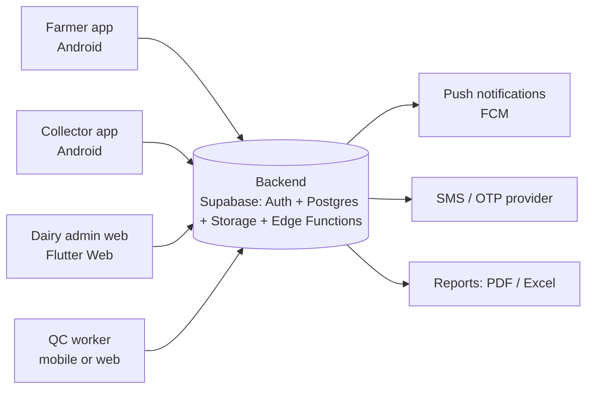
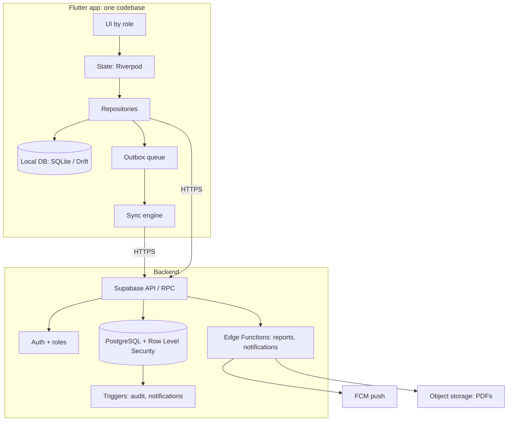

# Farm2Factory: High-Level Design (HLD)

| | |
|---|---|
| Version | 0.1 (draft) |
| Related | `PRD.md`, `LLD.md` |

The HLD explains **what the system is made of and how the parts talk to each other**. Table-level and code-level detail is in `LLD.md`.

---

## 1. Goals of the design

- Offline-first collection at centers with unreliable internet.
- One source of truth, shared by dairy, collectors and farmers.
- Server-enforced access: a farmer can only read their own data.
- Tamper-evident records: append-only history with timestamps.
- Simple enough for one developer to build and run, but able to grow.

---

## 2. System context

---

## 3. Architecture overview

**Layers**
1. **Presentation:** screens per role (collector, farmer, admin, QC).
2. **Domain/data:** repositories hide whether data is local or remote.
3. **Local persistence:** SQLite holds the working copy and the outbox.
4. **Sync engine:** pushes pending records, pulls updates.
5. **Backend:** Postgres is the source of truth; rules run in the database.
6. **Services:** push notifications, SMS/OTP, PDF/Excel generation.

---

## 4. Technology choices

| Concern | Choice | Why | Alternative |
|---|---|---|---|
| Mobile + web UI | Flutter (Dart) | One codebase, runs on low-end Android, web for admin | React Native + React |
| Backend | Supabase (managed Postgres) | Relational data, auth, row-level security, fast start | Node/Express + Postgres (more control, more work) |
| Local DB | Drift (SQLite) | Typed queries, migrations, offline | Isar, Hive |
| State management | Riverpod | Testable, simple | Bloc |
| Navigation | go_router | Role-based redirects | Navigator 2 |
| Push | Firebase Cloud Messaging | Free, standard | OneSignal |
| OTP / SMS | Local SMS gateway (e.g. MSG91) | Indian numbers, DLT support | Firebase phone auth |
| Reports | `pdf` package (client) + Edge Function (server, bulk) | PDF on device or server | Server-only |
| CI | GitHub Actions | Already on GitHub | |

**Why a relational database:** bills join farmers, collections and rate charts; payouts sum collections over a period; traceability follows lot to collections to farmers. This is natural in SQL and awkward in document stores.

---

## 5. Key components

| Component | Responsibility |
|---|---|
| Auth service | Login (ID + PIN or OTP), token, role claim |
| Master data | Dairy, centers, farmers, collectors, tankers |
| Rate service | Active rate chart by date; calculates rate and amount |
| Collection service | Record entries; versioned corrections |
| Sync engine | Outbox, retry, idempotency, pull of changes |
| QC and lot service | Tests, grading, lot to collections link |
| Billing service | Aggregates per farmer per period; PDF/Excel |
| Notification service | Correction alerts, payout alerts, collector warnings |
| Audit service | Immutable record of every change |

---

## 6. Core data flows

### 6.1 Record a collection (offline-capable)
1. Collector selects farmer, enters quantity, fat, SNF.
2. App calculates rate and amount from the locally cached rate chart.
3. Entry is saved to SQLite with a client-generated UUID and added to the outbox.
4. Sync engine sends outbox items when internet is available.
5. Server validates, stores with `server_time`, ignores duplicates by UUID.
6. Server marks the item synced; the app updates the local status.
7. Farmer's app pulls the new entry on next refresh or push.

### 6.2 Correct an entry
1. Collector chooses an entry and enters new values and a reason.
2. Server function `correct_collection` writes an edit log row and updates the current row, with a version increment.
3. A trigger creates a notification for the farmer: old value to new value, time.

### 6.3 Farmer views records
1. Farmer opens the app; local cache is shown immediately.
2. App pulls changes since the last sync (only their rows, by row-level security).
3. "Last updated" time is shown.

### 6.4 Month-end bill
1. Admin picks period and center.
2. Server aggregates collections per farmer using stored rate snapshots.
3. PDF or Excel is generated, stored, and a link or notification is sent.

### 6.5 Trace a rejected lot
1. QC marks a lot as rejected.
2. System follows lot to its collections to farmers and collectors.
3. Result list is shown with quantities and readings.

---

## 7. Offline and sync strategy

- Every record has a **UUID created on the device**.
- **Outbox pattern:** local writes and an outbox row are committed in one transaction.
- **Idempotent push:** the server uses upsert by UUID, so retries never duplicate.
- **Order:** outbox items are sent oldest first.
- **Pull:** the app asks for rows changed after its last `sync_cursor` (server timestamp).
- **Conflicts:** collection entries are created by one collector at one center, so conflicts are rare. For corrections, the server version number wins; a stale correction is rejected and the collector sees the latest values.
- **Timestamps:** `device_time` and `server_time` are both stored. A large gap is flagged.
- **Backup path:** if sync keeps failing, the app can export a signed PDF/CSV summary to share. This is a backup, not the source of truth.

---

## 8. Security and access control

- **Roles:** admin, supervisor, collector, qc, farmer, stored in `profiles.role`.
- **Row-level security (RLS) in Postgres:**
  - farmer: reads only rows where `farmer_id` is theirs
  - collector: reads and writes rows for their center
  - supervisor/admin: reads their dairy
  - qc: reads lots and writes QC tests
- **No public sign-up:** accounts are created by admin or collector through a server function.
- **Passwords/PINs:** hashed by the auth system; lockout after repeated failures.
- **Transport:** HTTPS only.
- **Local data:** sensitive tokens in secure storage; local DB encrypted if required later.
- **Audit:** all edits and logins logged. No deletes of business data.
- **Privacy:** farmer data is not shared across dairies.

---

## 9. Notifications

- Farmer: entry corrected; payout recorded.
- Collector: warning from supervisor about quality.
- Supervisor: lot rejected; unusual device-time gap.
- Delivery: FCM push, with in-app inbox as the fallback. SMS only for OTP and optionally for farmers without smartphones (later).

---

## 10. Scalability and performance

- Expected load per dairy: about 500 farmers x 2 shifts = 1,000 entries per day; 10,000 farmers = 20,000 per day. This is small for Postgres.
- Indexes on `(farmer_id, collected_on)` and `(center_id, collected_on)`.
- Partition `collections` by month if it passes tens of millions of rows.
- Monthly summaries are materialized for fast dashboards.
- Archive old rows to cold storage and exports; never delete.

---

## 11. Deployment and environments

| Environment | Purpose |
|---|---|
| Local | Supabase CLI + emulator |
| Staging | Test pilot builds |
| Production | Live dairy |

- Database changes through versioned SQL migrations in `supabase/migrations`.
- GitHub Actions: lint, test, build APK and web on every pull request.
- Releases: signed APK shared directly at pilot stage; Play Store later.
- Backups: daily database backup; restore tested before pilot.

---

## 12. Observability

- App crash reporting (Sentry or Firebase Crashlytics).
- Server logs and slow-query monitoring.
- Sync health metrics: pending items, failed items, oldest pending age.

---

## 13. Risks and trade-offs

| Decision | Trade-off |
|---|---|
| Supabase instead of custom backend | Faster, but ties logic to Postgres and Supabase; acceptable for MVP |
| One Flutter codebase for web and mobile | Flutter Web is less polished for dashboards; fine for internal admin |
| Offline-first | More complexity in sync; essential for the use case |
| Append-only data | Slightly more storage and complex queries; gives trust |
| Payments deferred | Faster MVP; payouts are recorded manually first |

---

## 14. Architecture decision log

| # | Decision | Status |
|---|---|---|
| ADR-1 | Flutter for all clients | Accepted |
| ADR-2 | PostgreSQL via Supabase | Accepted |
| ADR-3 | Local SQLite (Drift) with outbox sync | Accepted |
| ADR-4 | Server-side RLS for access control | Accepted |
| ADR-5 | No deletion, archive only | Accepted |
| ADR-6 | Payment gateway after pilot | Accepted |
