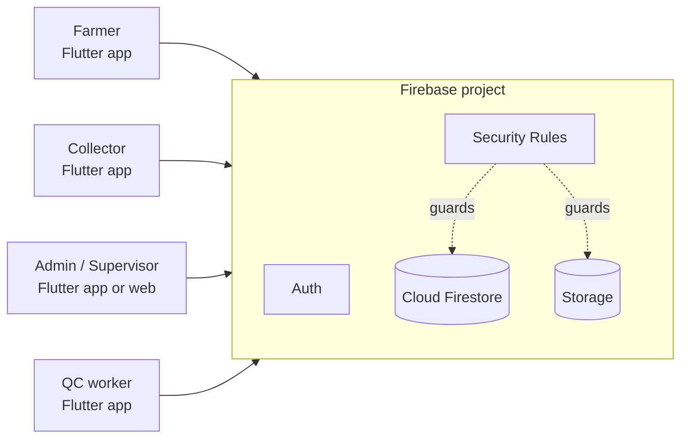
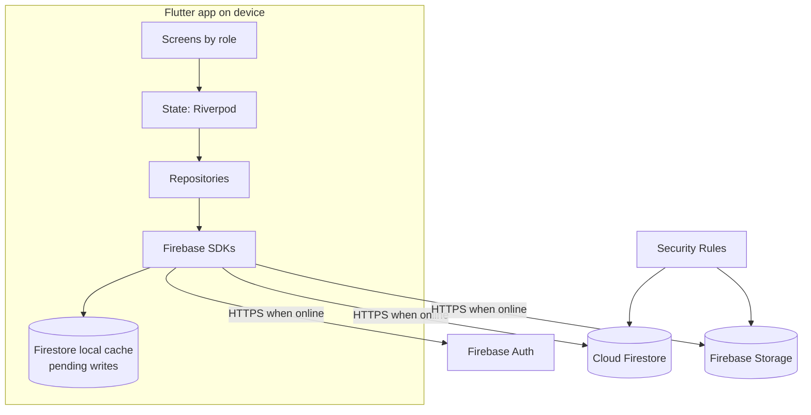

# Farm2Factory: High-Level Design (HLD)

| | |
|---|---|
| Version | 0.2 (draft) |
| Stack | Dart, Flutter, Firebase Auth, Cloud Firestore, Firebase Storage |
| Related | `PRD.md`, `LLD.md` |

The HLD explains **what the system is made of and how the parts talk to each other**. Document structure, security rules and code-level detail are in `LLD.md`.

---

## 1. Goals of the design

- Offline-first collection at centers with unreliable internet.
- One source of truth shared by dairy, collectors and farmers.
- Server-enforced access: a farmer can only read their own data.
- Tamper-evident records: no deletes, versioned corrections, server timestamps.
- Simple enough for one developer to build, using only the mandated stack.

---

## 2. Mandated stack and how each part is used

| Part | Role in Farm2Factory |
|---|---|
| **Dart** | Language for all app code, rate calculation and validation |
| **Flutter** | One codebase: collector app, farmer app, and admin screens (phone, tablet or Flutter Web) |
| **Firebase Auth** | Login and sessions for every user. Farmer ID or staff ID is mapped to an internal email, with a PIN or password. Phone OTP can be added later |
| **Cloud Firestore** | The database (NoSQL): users and roles, centers, rate charts, collections, edit history, lots, QC tests, payouts, notifications. Its built-in **offline cache and sync** replaces a custom sync engine |
| **Firebase Storage** | Files: PDF bills, exported reports (PDF/Excel), QC photos, profile photos |
| **Emulator / Device** | Android emulator and real low-end phones for running and testing the app. The **Firebase Emulator Suite** runs Auth, Firestore and Storage locally for safe development and rules testing |

Supporting Flutter packages: `firebase_core`, `firebase_auth`, `cloud_firestore`, `firebase_storage`, `flutter_riverpod` (state), `go_router` (navigation), `intl` (Hindi/English), `pdf` and `printing` (bills), `excel` (exports), `connectivity_plus` (banner only).

Not in the stack, so not used in the MVP: Cloud Functions, Firebase Cloud Messaging (push), Cloud SQL / Postgres, a separate backend server.

---

## 3. System context

---

## 4. Architecture overview

**Layers**
1. **Presentation:** screens per role.
2. **Repositories:** the only code that talks to Firebase; screens never call it directly.
3. **Firebase SDK + local cache:** reads come from the cache when offline; writes are queued and sent when online.
4. **Firebase services:** Auth identifies the user; Security Rules decide what they can read or write.

There is no custom server. **Security Rules are the backend's rule engine**, so they are written and tested as carefully as code.

---

## 5. Key components

| Component | Responsibility |
|---|---|
| Auth module | Login, logout, session, role lookup from the user's profile document |
| Account service | Admin or collector creates users (using a secondary Firebase app instance so the creator stays logged in) |
| Master data | Dairy, centers, farmers, collectors, tankers |
| Rate service | Finds the active rate chart for a date; calculates rate and amount with integer math |
| Collection service | Creates entries (offline-capable); versioned corrections (online) |
| Sync status | Shows pending writes, "Sync now", "Close shift" reconciliation |
| QC and lot service | QC tests, grading, lot to entries link, trace |
| Billing and export | Sums per farmer and period; PDF/Excel saved to Storage |
| Notification service | In-app inbox documents (correction alerts, warnings, payouts) |
| Audit | `edits` history per entry; no deletes |

---

## 6. Core data flows

### 6.1 Record a collection (offline-capable)
1. Collector picks the farmer, enters quantity, fat, SNF.
2. App calculates rate and amount from the cached rate chart.
3. App writes the entry document with ID `<farmerCode>_<date>_<shift>`. The write goes to the local cache at once and is queued.
4. When the phone is online, Firestore sends the write. Security Rules validate it. A duplicate ID or bad values are rejected.
5. The server stamps `serverTime`. The app shows the entry as synced (no pending-write flag).
6. The farmer's app receives the new entry through its live query.

### 6.2 Correct an entry (online only)
1. Collector opens an entry and enters new values and a reason.
2. App reads the latest version from the server.
3. One **batched write** updates the entry (version + 1), adds an `edits/<version>` history document, and adds a notification for the farmer. Rules only allow the update if the history document is written in the same batch.

### 6.3 Farmer views records
1. Farmer opens the app; cached data shows instantly.
2. A query for their own entries (by date range) refreshes from the server.
3. "Last updated" time is shown when offline.

### 6.4 Month-end bill
1. Admin picks period and center.
2. App queries entries for each farmer and period, sums the stored amounts, builds a PDF with the `pdf` package.
3. PDF is uploaded to Storage; the farmer sees it in their payments screen. A `payouts` document records status.

### 6.5 Trace a rejected lot
1. QC marks the lot as rejected.
2. App queries entries where `lotId` equals the lot, and lists farmers, collectors, quantities and readings.

---

## 7. Offline strategy

Firestore provides offline persistence on Android and iOS. We rely on it, with these rules:

- **Writes while offline** are applied to the local cache and queued. They survive app restarts and are sent automatically when online.
- **Do not wait for the write result while offline.** The write's future only completes after the server confirms, so screens must not freeze waiting for it.
- **Pending indicator:** listen with metadata changes and show entries that still have pending writes as "waiting to sync".
- **Master data must be cached first.** Offline reads only return data the device has already loaded. The collector taps "Sync now" while online to load farmers and rate charts.
- **No duplicates:** entry IDs are deterministic, and the rules only allow *creating* a new ID.
- **Timestamps:** `deviceTime` is stored with the entry; `serverTime` uses the server timestamp, which is filled in on sync. A big gap is flagged.
- **Corrections require internet.** A queued update that the server rejects is discarded by the SDK, so corrections are done online only.
- **Reconciliation:** "Close shift" compares local totals with server totals so any dropped entry is found the same day.
- **Backup:** an exported PDF summary from the device is the fallback; it is never the source of truth.

---

## 8. Security and access control

- **Roles:** `admin`, `supervisor`, `collector`, `qc`, `farmer`, stored in the user's profile document in `users/{uid}`.
- **Security Rules (Firestore):**
  - farmer: reads only entries where `farmerId` is their own uid
  - collector: creates and reads entries for their own center
  - supervisor and admin: read their whole dairy
  - qc: reads lots, writes QC tests
  - nobody can delete business documents; entries can only be changed through the versioned correction rule
- **Security Rules (Storage):** a farmer can read only their own bills; staff upload for their dairy.
- **No public sign-up:** accounts are created by admin (or a collector for farmers of their center). Self-registration is not exposed.
- **Credentials:** handled by Firebase Auth; the app never stores PINs.
- **Firebase config files** (`google-services.json`) identify the project but are not secrets. Real protection comes from the rules.
- **Audit:** edit history is kept in `edits` subcollections.
- **Privacy:** every document carries the dairy ID, and rules check it.

---

## 9. Notifications

- In-app notification documents under `users/{uid}/notifications`, shown in an inbox with an unread badge.
- Farmer: entry corrected, payout recorded. Collector: supervisor warning. Supervisor: lot rejected.
- Push notifications (FCM) are a later addition because they need Cloud Functions or a server.

---

## 10. Scalability and cost

- Volume per dairy: 500 farmers x 2 shifts = 1,000 entries per day; 10,000 farmers = 20,000 per day. This is well inside Firestore's capacity.
- Firestore charges per document read and write, so:
  - farmer screens read one month at most (about 60 documents)
  - lists are paginated
  - dashboards query a date range, not the whole collection
  - avoid listeners on large collections
- Free plan limits are small (tens of thousands of reads per day). Budget alerts should be set before the pilot. Storage and SMS may require the pay-as-you-go plan: check current Firebase pricing.
- Composite indexes are defined in `firestore.indexes.json`.
- Retention: documents are never deleted. The app shows the last 6 months (farmer) or 12 months (collector) by query. Older months are exported to Storage.

---

## 11. Environments and tooling

| Environment | Purpose |
|---|---|
| Local | Firebase Emulator Suite (Auth, Firestore, Storage) with Android emulator or device |
| Dev project | Real Firebase project for integration testing |
| Prod project | Live pilot, separate project from dev |

- `firebase.json`, `firestore.rules`, `storage.rules` and `firestore.indexes.json` live in the repo and are deployed with the Firebase CLI.
- Connect the app with `flutterfire configure` for each project.
- Test Security Rules automatically with the emulator before every deploy.
- CI (GitHub Actions): format, analyze, unit tests, rules tests.

---

## 12. Limitations of this stack and how we handle them

| Limitation | Handling |
|---|---|
| No server-side code in the stack, so no server recalculation of amounts | Integer math on the device, rules check ranges and ownership; add Cloud Functions later for recalculation |
| No joins or complex aggregation | Documents shaped around queries; sums done in the app per farmer and period |
| Rejected offline writes can vanish after restart | Validate before saving, "Close shift" check, corrections online only |
| Rules logic is hard to test by hand | Rules tests in the emulator are mandatory |
| Cost grows with reads | Narrow queries, pagination, caching |
| Creating users from the client signs the creator out | Use a secondary Firebase app instance |
| Vendor lock-in | Accept for MVP; keep Firebase calls inside repositories |

---

## 13. Architecture decision log

| # | Decision | Status |
|---|---|---|
| ADR-1 | Flutter and Dart for all clients | Accepted (mandated) |
| ADR-2 | Cloud Firestore as the only database | Accepted (mandated) |
| ADR-3 | Firebase Auth with ID-to-email mapping and PIN | Accepted (mandated) |
| ADR-4 | Firebase Storage for PDFs and photos | Accepted (mandated) |
| ADR-5 | Use Firestore offline persistence instead of a custom sync engine | Accepted |
| ADR-6 | Deterministic entry IDs for duplicate prevention | Accepted |
| ADR-7 | Versioned corrections through batched writes, online only | Accepted |
| ADR-8 | Security Rules are the access layer and are tested in the emulator | Accepted |
| ADR-9 | No deletion; archive by export | Accepted |
| ADR-10 | Cloud Functions, FCM and payment gateway deferred | Accepted |
